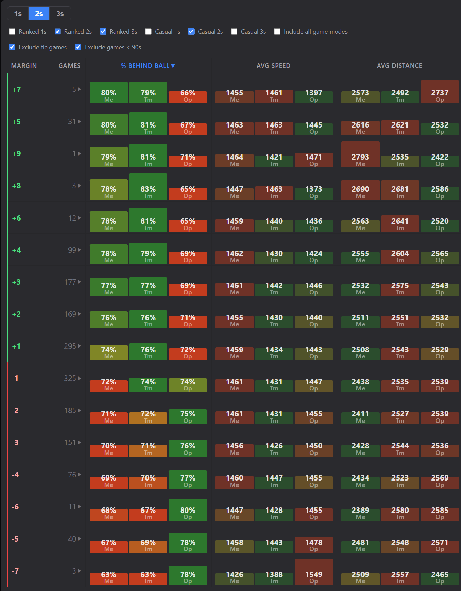
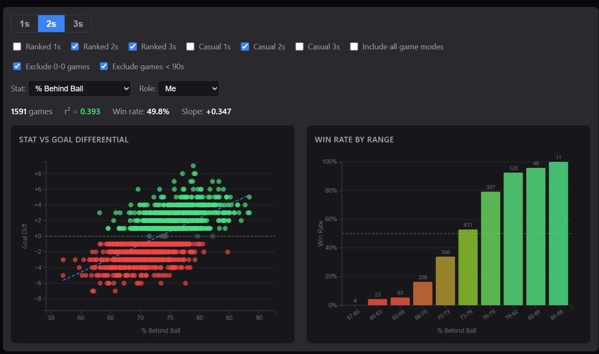

# Ballchasing Replay Dashboard

A local dashboard for analyzing your Rocket League replays. Syncs replay data from [ballchasing.com](https://ballchasing.com), caches it in SQLite, and serves a web UI for exploring your stats.

## How It Works

1. **Sync** your replays from ballchasing.com for any date range
2. **Identify** yourself and your teammates from the player list
3. **Analyze** your games across multiple views

## Analysis Views

### Win/Loss by Margin

Games grouped by goal differential. Each row averages positioning and speed stats (% Behind Ball, Avg Speed, Avg Distance to Ball) broken down by role (Me / Teammates / Opponents). Click any row to expand and see individual games.



### Correlations

Pick any stat and see how it correlates with winning. Scatter plot shows stat value vs goal differential with a trend line. Bar chart shows win rate across stat ranges.



## Stack

- **Backend**: Python, FastAPI, SQLite, httpx
- **Frontend**: Lit, Rsbuild
- **Data**: [ballchasing.com API](https://ballchasing.com/doc/api)

## Setup

```
# Backend
python -m venv venv
source venv/bin/activate
pip install -r requirements.txt

# Frontend
cd frontend && npm install

# Configure
cp .env.example .env
# Add your ballchasing.com API key to .env
```

## Run

```
./dev.sh
```

Opens at http://localhost:3000. Backend on :8000, frontend dev server on :3000 with API proxy.

## Test

```
venv/bin/pytest
```
